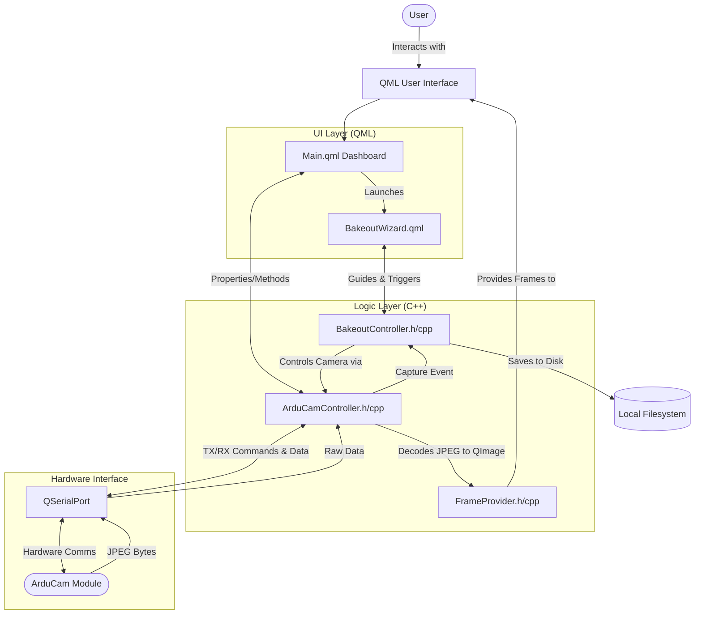

# Bakeout-CLI

## Overview

The **Bakeout-CLI** (Payload-Arducam-Bakeout-Test-Automation-UI) is a desktop application built using the Qt framework (C++ and QML). Its primary purpose is to conduct automated Pre-Bakeout and Post-Bakeout image testing and serve as a graphical user interface for controlling an ArduCam hardware module.

The software ensures exact, reproducible environmental conditions across image capture sessions so that precise measurements can be taken before and after the "bakeout" testing phase. It guides the user step-by-step through the physical environment setup, automatically calibrates camera exposure to match target ambient lighting, and automatically captures high-resolution image bursts around a full 360-degree rotation.

## User Guide

### 1. Connection and Setup
1. Open the application. You will see the main **ArduCAM Host** dashboard.
2. Under the "COMPort" panel, select the correct COM port from the dropdown menu to match your ArduCam module.
3. Click the **Connect** button to establish a serial connection.
4. Open the live preview by ensuring the camera resolution is appropriately set (default recommended: `320x240`) and clicking **Start Streaming**. The right panel will display the live camera feed.

### 2. Manual Controls (Optional)
From the dashboard, you have several direct hardware controls:
- **Resolution:** Manually switch camera resolution from the dropdown. 
- **Auto Exposure:** Toggle Auto Exposure on and select an EV preset bias.
- **Manual Exposure:** Uncheck Auto Exposure and use the slider or text box to enter an exposure time in microseconds.
- **Single Capture:** Click `Capture (Single)` to take an immediate snapshot. Check the nearby box to automatically save single shots to the `./temp` folder.

### 3. Running the Bakeout Wizard
The automated tests are accessed via the two buttons in the Camera panel: **Pre-Bakeout** and **Post-Bakeout**. They both launch the Bakeout Wizard.

#### Pre-Bakeout Test
1. Click the **Pre-Bakeout** button. The wizard will lead you through 7 physical setup steps:
   - Find a physical area at least 230cm long with a flat, level surface (verify with a spirit level).
   - Ensure constant lighting conditions (preferably a room with no windows) to guarantee identical conditions for the post-bakeout test.
   - Position the ArduCam lens to face purely horizontally, parallel to the ground.
   - Place the target pattern exactly 191.5cm from the end of the camera lens face.
   - Verify alignment using the live preview in the ArduCam Host window. The target must perfectly fill the entire frame.
   - Secure the camera and all wiring firmly with tape.
   - Note and record any variable lighting conditions to recreate them during the Post-Bakeout phase.
2. Proceed through the wizard to the **Exposure Calibration** phase. You can either choose automatic calibration (the software adjusts exposure to a target average brightness of 160) or manually input a known exposure microsecond value.
3. Once calibration is recorded, the software will automatically maximize the resolution to `2592x1944` and guide you through the 360-degree image capture phase.
4. For each angle:
   - Ensure the apparatus is at the requested angle (starting at 0°).
   - Click Next. The camera will automatically capture 5 high-resolution images.
   - You will be instructed to rotate the apparatus by 15°.
   - Repeat this process until 360 degrees is reached (24 angles total, yielding 120 images).
5. All images are securely saved to an automatically generated `./Pre-Bakeout/` local directory.

#### Post-Bakeout Test
1. Click the **Post-Bakeout** button.
2. The wizard will instruct you to replicate the **exact** physical setup from the Pre-Bakeout test. Use your previously recorded lighting conditions and alignment notes.
3. Use the live preview to confirm identical framing.
4. Proceed through the identical Calibration and 360-degree capture sequence.
5. All images are securely saved to an automatically generated `./Post-Bakeout/` local directory.

---

## System Architecture

### 1. System Flow Chart

### 2. Component Breakdown

The system relies on a clean separation of concerns: the visual frontend is written in QML for rapid UI development, while the backend logic, hardware communication, and heavy processing are handled in C++.

#### UI Layer (QML)
* **`Main.qml` (Application Dashboard):** Acts as the primary control center. It allows the user to configure serial connections, preview the layout, and manually test camera configurations natively.
* **`BakeoutWizard.qml` (Automated Test Wizard):** A state-machine-driven wizard dialog. It guides the user linearly through the automated calibration and 24-step 360-degree rotation picture-taking loop.

#### Auto Calibration Process
* The auto calibration process is a two-step process:
    * First, the software captures a series of images at different exposure settings.
    * The Images are converted to grayscale and the average luminance (brightness) is calculated for each image.
    * A binary search is preformed until a target average luminance (brightness) of 160(±5) is reached.
    * The value of 160(±5) was chosen as an experimentally derived result.
    * In previous bakeout tests that used a manual exposure process, the average brightness after accounting for outliers (greater or less than 20% of the average before accounting for outliers) was used to determine the exposure value.

#### Logic Layer (C++)
* **`ArduCamController`:** The core hardware communication and state management layer. It maintains a robust queue for sending hexadecimal commands to the camera. It safely parses the incoming serial byte stream to isolate text logs separately from raw JPEG byte data bursts. It emits decoded images via a signal cleanly.
* **`BakeoutController`:** The orchestration engine for the Bakeout Test sequence. During calibration, it analyzes decoded JPEGs mathematically to resolve the average luminance (brightness) until an exact exposure microsecond value is found. During capture, it tracks the current rotational degree and dynamically creates localized folders to persist the captured images.
* **`FrameProvider`:** Bridging image data from C++ to the QML rendering engine quickly. Decoded `QImages` are piped directly through it under the `image://frame/...` URL scheme.

    
